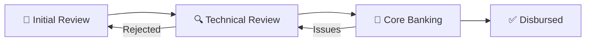

# 🚀 Advanced Withdrawal Request Tracker

A comprehensive, enterprise-level withdrawal request management system built with React, featuring AI-powered OCR simulation, advanced analytics, real-time notifications, and complete audit trail functionality.


## 🌟 **Live Demo**

Simply open `index.html` in your browser - no installation required!

## ✨ **Key Features**

### 📊 **Interactive Dashboard**
- Real-time statistics and KPI monitoring
- Regional operations team overview
- Live process tracking with visual indicators
- Role-based access controls for 7 user types

### 📈 **Advanced Analytics**
- Comprehensive KPI cards (Success Rate, Processing Time, SLA Compliance)
- Regional performance heatmaps with efficiency metrics
- Interactive process flow diagrams
- Visual data representations and trend analysis

### 🔔 **Smart Notification Center**
- Real-time alerts with priority levels (Urgent, Approval, Reminder)
- Interactive notification management (Mark as Read, Dismiss)
- Notification badges with unread counts
- Color-coded notification types with timestamps

### 📋 **Complete Audit Trail**
- A-to-Z tracking from request creation to disbursement
- Detailed audit entries with user attribution
- Visual timeline with step-by-step progression
- Comprehensive audit statistics and summaries

### 🤖 **AI-Powered OCR Simulation**
- Realistic document processing workflow
- Automatic data extraction from uploaded documents
- Smart field mapping and validation
- Regional auto-assignment based on country

### 🛡️ **Role-Based Security**
- **Archive Team**: Create and upload requests
- **Operations Teams**: Review and approve/reject requests (4 regional teams)
- **Core Banking**: Process disbursements
- **Loan Admin**: Full system oversight and analytics

## 🎯 **User Roles & Permissions**

| Role | Permissions | Region |
|------|-------------|---------|
| 👩‍💼 Sarah Archive | Create requests, Upload documents | Global |
| 👨‍💼 John Administrator | Full system access, Analytics | Global |
| 👨‍🔧 Ahmed Operations | Approve/Reject requests | North Africa |
| 👩‍🔧 Fatima Operations | Approve/Reject requests | Central Africa |
| 👨‍💼 Chen Operations | Approve/Reject requests | South East Asia |
| 👩‍💼 Amira Operations | Approve/Reject requests | Central Asia |
| 👩‍💻 Lisa Banking | Process disbursements | Global |

## 🔄 **Workflow Process**



1. **📝 Initial Review**: Request created via OCR, auto-assigned to regional team
2. **🔍 Technical Review**: Operations team reviews and approves/rejects
3. **🏦 Core Banking**: Approved requests sent for disbursement processing
4. **✅ Disbursed**: Final disbursement completed and recorded

## 🛠️ **Technical Stack**

- **Frontend**: React 18 with Hooks
- **Styling**: Tailwind CSS with Glassmorphism design
- **State Management**: React useState/useEffect
- **Build**: No build process required - pure HTML/JS
- **Deployment**: Static hosting compatible

## 🚀 **Quick Start**

### Option 1: Direct Browser Access
```bash
# Clone the repository
git clone https://github.com/Mitty530/System-Automated.git

# Navigate to the directory
cd System-Automated

# Open in browser
open index.html
```

### Option 2: Local Server (Optional)
```bash
# Using Python
python -m http.server 8000

# Using Node.js
npx serve .

# Using PHP
php -S localhost:8000
```

Then visit `http://localhost:8000`

## 📱 **Browser Compatibility**

- ✅ Chrome 90+
- ✅ Firefox 88+
- ✅ Safari 14+
- ✅ Edge 90+

## 🎨 **Design Features**

- **Glassmorphism UI**: Modern frosted glass effects
- **Gradient Backgrounds**: Beautiful color transitions
- **Smooth Animations**: Hover effects and transitions
- **Responsive Design**: Optimized for desktop use
- **Emoji Icons**: Intuitive visual indicators
- **Color-Coded Status**: Easy status identification

## 📊 **Sample Data**

The system comes pre-loaded with realistic sample data:
- 5 withdrawal requests across different regions
- Complete audit trail history
- Regional team assignments
- Various request statuses and priorities

## 🔧 **Customization**

### Adding New Countries/Regions
Edit the `regionMapping` object in `index.html`:
```javascript
const regionMapping = {
  'YourCountry': 'Your Region',
  // ... existing mappings
};
```

### Adding New User Roles
Extend the `mockUsers` object:
```javascript
const mockUsers = {
  'newuser': { 
    id: 8, 
    username: 'newuser', 
    name: 'New User', 
    role: 'new_role', 
    avatar: '👤' 
  }
};
```

## 📈 **Analytics Features**

- **Success Rate Tracking**: Monitor completion percentages
- **Processing Time Analysis**: Average time from creation to disbursement
- **SLA Compliance**: Track adherence to processing deadlines
- **Regional Performance**: Compare efficiency across regions
- **Bottleneck Identification**: Identify workflow constraints

## 🔐 **Security Features**

- Role-based access controls
- Action-level permissions
- Audit trail for all operations
- User attribution for all actions
- Session-based authentication simulation

## 🤝 **Contributing**

1. Fork the repository
2. Create a feature branch (`git checkout -b feature/amazing-feature`)
3. Commit your changes (`git commit -m 'Add amazing feature'`)
4. Push to the branch (`git push origin feature/amazing-feature`)
5. Open a Pull Request

## 📄 **License**

This project is licensed under the MIT License - see the [LICENSE](LICENSE) file for details.

## 👨‍💻 **Author**

**Mamadou Oury Diallo**
- GitHub: [@Mitty530](https://github.com/Mitty530)
- Email: 58902829+Mitty530@users.noreply.github.com

## 🙏 **Acknowledgments**

- Built with React and Tailwind CSS
- Inspired by modern financial workflow systems
- Designed for enterprise-level demonstrations

---

⭐ **Star this repository if you found it helpful!**
